*[Version française](index.html)*

House of caracter in the medieval town of Gaillac
=================================================

The house, of medieval time, is located in the Quai St Jacques historical and lively area.
Just 2 minutes from the St Michel Abbaye and its wine museum, and from the beautiful banks of the Tarn, the house is in the heart of the historical part of the town, surrounded by pedestrian streets. Next door is the oldest building in town, that has been recently completely and beautifully renovated.

{style="height:300px;"}\ 

Ground floor
-----------------

The kitchen and dining room

|   |   |   |   |
|:-:|:-:|:-:|:-:|
|  | 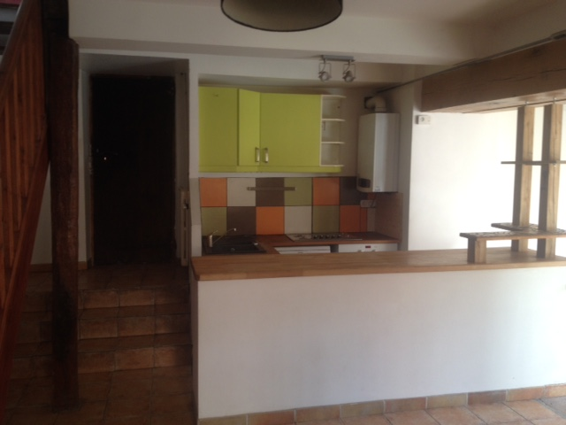 |   |  | 

The living room

|   |   |
|:-:|:-:|
|  |  | 

Spare room (that could easily be converted in a 3rd bedroom)

|   |   |
|:-:|:-:|
| 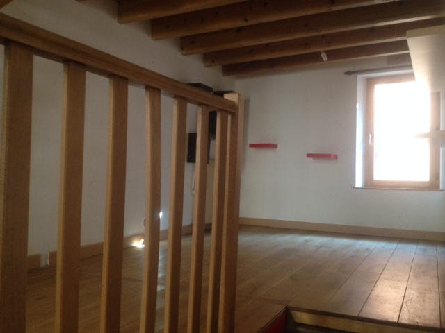 |  | 

*The spare room is open on the loft bedroom  *

First
-------

|   |   |   |
|:-:|:-:|:-:|
| 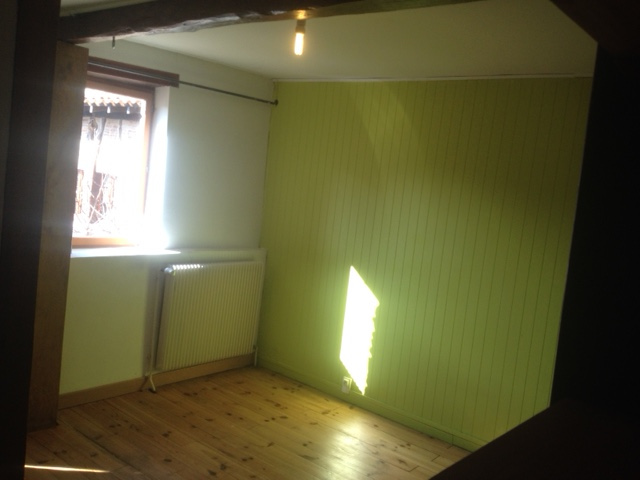 | 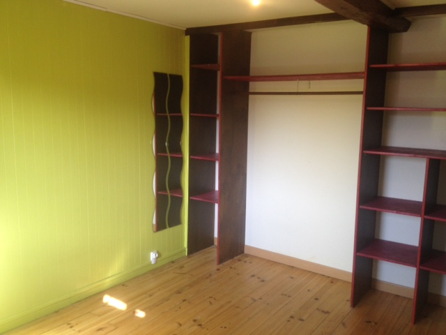 | 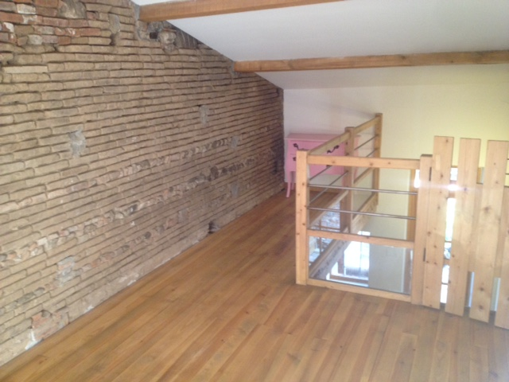 | 
| First bedroom, facing South| Good storage capacity | Second (loft) bedroom |

Bathroom

|   |   |
|:-:|:-:|
| 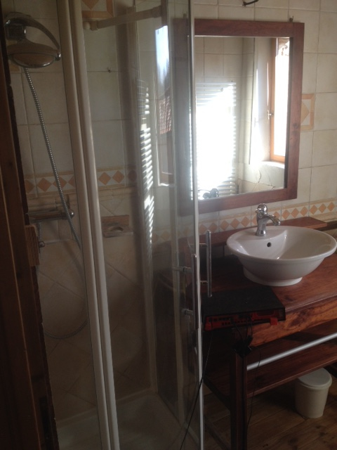 | 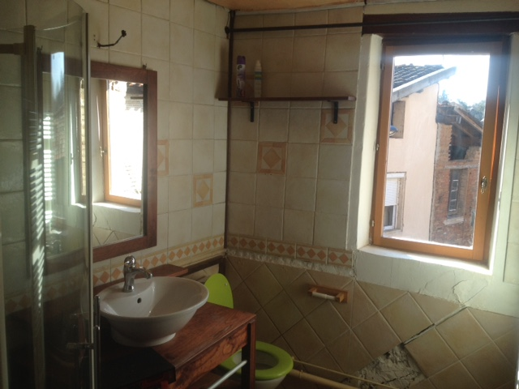 | 

* The tiled walls and ceiling will need some refurbishment; there is small storage/laundry space, equiped with a washing machine.  * 

The outdoors
--------------

|   |   |   |   |
|:-:|:-:|:-:|:-:|
|  |  |  |  | 
| The garden in Summer time| The South gable   | Wisteria and oleander surrounding the front door  | Beautiful river Tarn is just down the street |

Gaillac
-------

\ 

[Gaillac](https://en.wikipedia.org/wiki/Gaillac) is a beautiful little town dating from the 2nd century. Located on the bank of the river Tarn, it is well known for the wine that bear its name. Wine, music and book festivals are organized throughout the Summer.
The house is situated in the Vieux Gaillac (the medieval center of the town).

The surrounding area
---------------------

Gaillac is surrounded by natural and historical sites of exception, among which many are UNESCO sites, as for example [Cordes sur
Ciel](http://www.cordessurciel.fr/) (about 20 km), [Albi](www.albi-tourisme.fr) (15 min by car) or [Carcassonne](http://www.tourisme-carcassonne.fr).

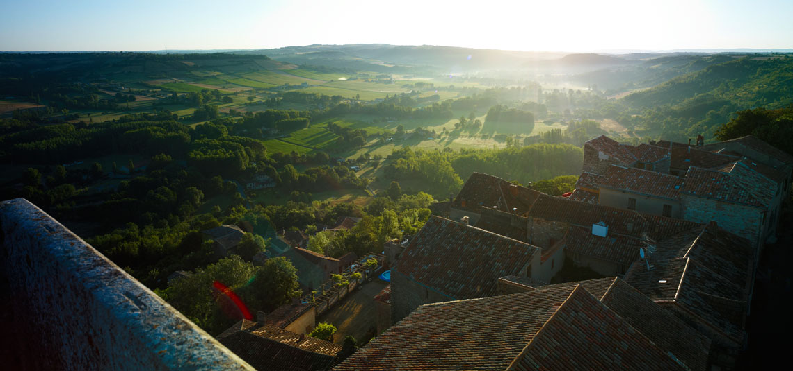 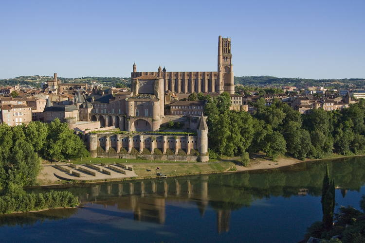 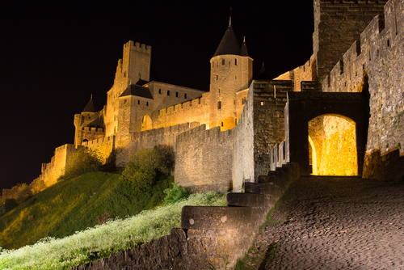

And last but not least, [Toulouse](http://www.toulouse-tourisme.com/) : "la ville rose",  a major cultural, economical and academic center is situated only 40 minutes away by car or by train.

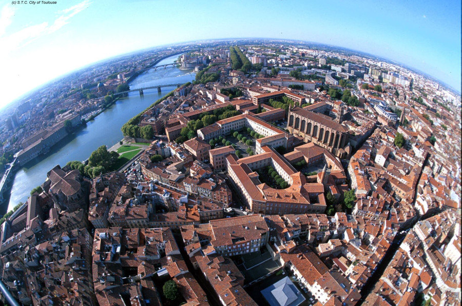\ 

For the outdoors lovers, Gaillac is at the heart of a splendid region: The Pyrenees and the Cévennes national park can be reached by driving in 1h30min and the Mediterranean sea in less than 2 hours.

\ 

At direct proximity the large forest of Sivens is a beautiful setting for biking and walks.

Frequently Asked Questions
----------------------------

- * What is the size of the house ? *

The house is about 90m² (loi Carrez) with the addition of a 10m² shed , and a 90m² garden.

- * How much is the "taxe d'habitation*

It is about 250 euros.

- * What is the heating system ?*

The house is heated by gaz, equipped with a recent boiler (2010) and a an electronic thermostat.

Do not hesitate to contact us if you have other questions !

Contact
--------------

- email : [claireetseverin@guakamole.org](mailto:claireetseverin@guakamole.org)
- phone: 00447907986893 

