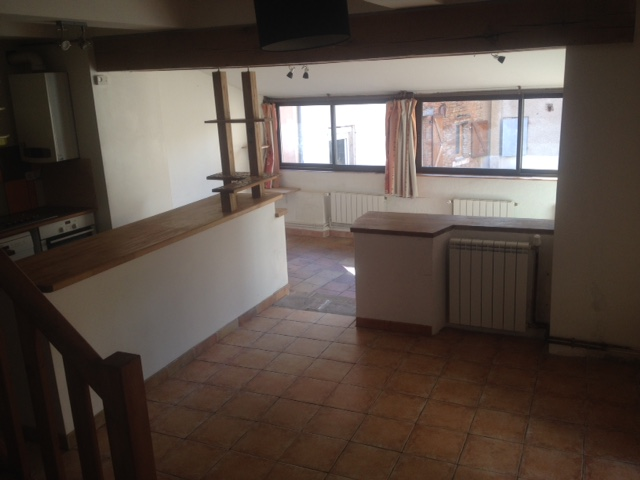

Une maison de caractère à Gaillac
=================================

La maison, d'époque médiévale, est située dans le quartier historique et vivant
du Quai St Jacques. Située à deux pas de l'abbaye et du Tarn, elle est au coeur
du Vieux Gaillac et de ses petites rues piétonnes (en cours de mise en valeur
par la commune).

Le rez-de-chaussé
-----------------

La cuisine et salle à manger

|   |   |   |   |
|:-:|:-:|:-:|:-:|
|  |  |   |  | 

Le salon

|   |   |
|:-:|:-:|
|  |  | 

Le bureau (amménageable en 3ème chambre)

|   |   |
|:-:|:-:|
|  |  | 

*Le bureau donne sur la chambre en mezzanine, et peut faire un très bel ensemble
"chambre + bureau".*

L'étage
-------

|   |   |   |
|:-:|:-:|:-:|
|  |  |  | 
| Première chambre, donnant au Sud | De nombreux rangements | Seconde chambre, en mezzanine |

La salle de bain

|   |   |
|:-:|:-:|
|  |  | 

*Des travaux de décoration (carrelage mural, plafond) sont à prévoir ; un petit
espace rangement/buanderie est attenant, équipé avec une machine à laver.*

Les extérieurs
--------------

|   |   |   |   |
|:-:|:-:|:-:|:-:|
|  |  |  |  | 
| Le jardin, exhubérant en été | Le pignon Sud   | Glycine et lauriers roses entourent la porte d'entrée  |  À deux pas de la maison, le bord du Tarn |

Gaillac
-------

\ 

[Gaillac](https://fr.wikipedia.org/wiki/Gaillac) est une belle bourgade de 15
000 habitants, posée sur les rives du Tarn. Haut-lieu du vin, la ville est
entourée de vignobles et organise plusieurs fois par an des festivals du vin.

La maison est dans le Vieux Gaillac (le centre médiéval de la ville), dans le quartier
du Quai St Jacques. [L'association du Quai St
Jacques](https://www.facebook.com/AssociationDuQuaiSaintJacques), animée par les
habitants du quartier, organise très régulièrement concerts, fêtes et grand
repas de quartier.

Dans les environs
-----------------

Gaillac est entouré de sites naturels et historiques exceptionels, dont de
nombreux sont classés à l'UNESCO, comme [Cordes sur
Ciel](http://www.cordessurciel.fr/) (à une vingtaine des kilomètres), [Albi](www.albi-tourisme.fr) (15 min en voiture) ou encore [Carcassonne](http://www.tourisme-carcassonne.fr).

  

Et bien sûr, [Toulouse](http://www.toulouse-tourisme.com/) : la ville rose, capitale de l'Occitanie, est un centre culturel,
économique et académique majeur, à seulement 40 min de train ou voiture.

\ 

Et pour les amoureux de la nature, Gaillac est au coeur d'une région magnifique : les Pyrénées et le parc national des Cévennes sont à 1h30 de voiture, la Méditerrannée à moins de deux heures.

\ 

Et à proximité immédiate, la grande forêt de Sivens offre de nombreuses
possibilités de ballade à pied ou à vélo.

Questions fréquentes
--------------------

- *Quelle est la surface de la maison ?*

La maison fait environ 90m² (loi Carrez), auquel s'ajoute un appenti attenant à
la maison de 10m², et le jardin de 90m².

- *Quel est le montant de la taxe d'habitation ?*

Environ 800 euros.

- *Comment la maison est-elle chauffée ?*

Chauffage au gaz, chaudière récente (2010), avec thermostat d'ambiance électronique programmable.

N'hésitez pas à nous contacter si vous avez d'autres questions !

Nous contacter
--------------

Pour nous contacter:

- par email : [claireetseverin@guakamole.org](mailto:claireetseverin@guakamole.org)
- par téléphone : 00447907986893 (numéro en Angleterre où nous sommes
  actuellement résidents)

