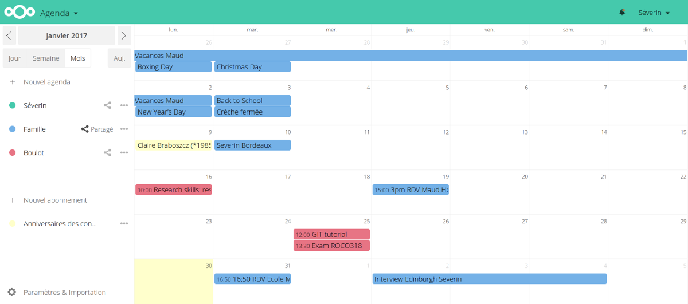

Comment "de-googliser" Internet?
================================

Dans l'esprit de la campagne menée par
[Framasoft](https://degooglisons-internet.org/), nous avons essayé de reduire
notre dépendance aux grosses entreprises d'Internet qui ont la main sur toutes
nos données.

Le programme
------------

Au programme, et pour commencer, on veut reprendre le contrôle sur les services suivants:

- Gmail (ou n'importe quel autre fournisseur de mail) et la gestion des contacts
- Google Calendar
- Dropbox/Google Drive/Microsoft OneDrive
- Skype/Google Hangout

Après quelques efforts (et un peu moins de 20 € par an pour l'hébergement et le nom de domaine), nous sommes arrivés à quelque chose qui ressemble à ça:

- L'écran de connection -- familial!

{.class width=600px}

- L'agenda, très proche de ce que propose Google Calendar par exemple:

{.class width=600px}

- Le webmail:

{.class width=600px}

- Le gestionnaire de contacts:

{.class width=600px}

- Les appels vidéos (on peut soit appeler des contacts ou groupe de contacts,
  soit créer des appels vidéos publics, que n'importe qui peut rejoindre en
  cliquant sur un lien):

{.class width=600px}

Les étapes
----------

1. Se créer un nom de domaine
2. Ouvrir un compte chez un hébergeur de sites web
3. Installer le logiciel (Nextcloud)
4. Personnaliser et configurer Nextcloud
5. Mettre à jour la configuration de son téléphone, de Thunderbird, de Outlook,
   etc.

